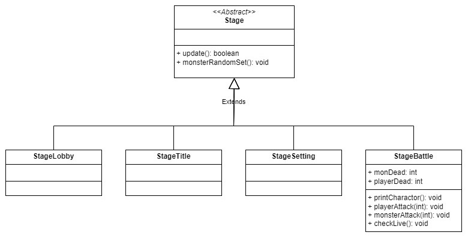
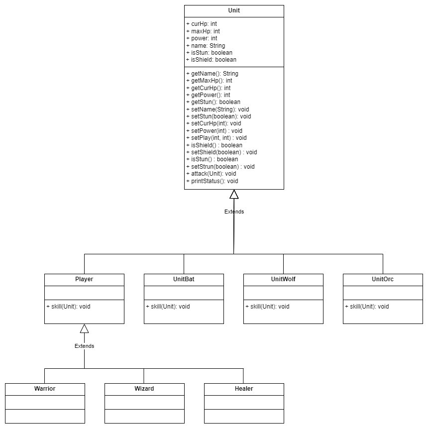

# Text RPG
 

> 게임 설명
> 
콘솔을 RPG 게임
원하는 직업을 선택하여 플레이할 수 있다.  
랜덤으로 생성되는 몬스터를 잡으며 앞으로 나아갈 수 있다.   
> 게임 기능
1. 로비
2. 배틀

#### 로비
* 배틀을 시작할 지 게임을 종료할 지 결정할 수 있다.
* 1을 선택할 시 배틀모드로 전환되고, 2를 선택할 시 게임이 종료된다.

#### 배틀
* 최초 배틀을 시작할 때 원하는 직업을 선택하여 플레이어를 조합할 수 있다.
* 플레이어의 상태와 랜덤으로 생성된 몬스터들의 상태가 보여지는 창이 뜬다.
* 플레이어는 각 턴마다 일반 공격과 스킬 중 하나를 골라 몬스터에게 데미지를 입힐 수 있다.
* 플레이어들의 턴이 끝나면 몬스터들의 공격이 시작된다.
* 몬스터들은 일정 확률로 일반 공격과 스킬 중 하나로 플레이어에게 데미지를 입힌다.
* 몬스터들을 전부 처치하면 로비로 돌아올 수 있으며, 플레이어가 전부 사망하면 게임이 종료된다.    

## Stage Diagram (UML)
<!--  -->
  
## Unit Diagram (UML)
      

## DEMO
   
